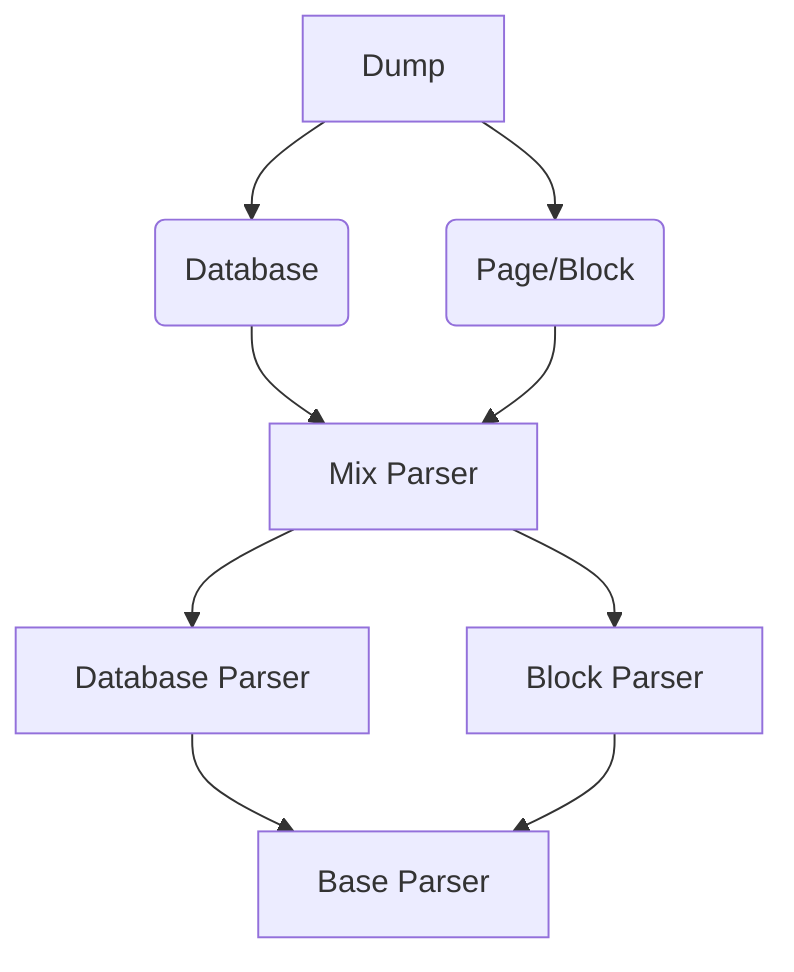

# notion-export-kernel

[中文](https://github.com/delta1037/notion-export-kernel/blob/main/README_zh.md)

## Description

This repository is a development based on [notion-sdk-py](https://github.com/ramnes/notion-sdk-py)（notion official API）,  target to export notion pages and database

Main targets：

- [x] Export Notion Database and page to markdown file
- [x] Recursion Export child Pages
- [x] Download image and files in notion

## Structure

```shell
notoin-dump
├─NotionDump
│  ├─Dump   # External Interface
│  ├─Notion # Unified encapsulation interface for communication with Notion
│  ├─Parser # Some parser
│  └─utils  # Internal variables and utils functions
└─Tests 	# Test code
```

#### Parser code structure



## Usage

### 3.0 install & example

**install `notion-dump-kernel`**

```powershell
# open terminal, type the cmd (install the latest version)
pip install python-dateutil
pip install notion-dump-kernel
```

**example**

```python
# Example: export page
import NotionDump
from NotionDump.Dump.dump import Dump
from NotionDump.Notion.Notion import NotionQuery
from NotionDump.utils import common_op

TOKEN_TEST = "secret_xxxxxxxxxxxxxxxxxxxxxxxxxxxxxxxxxxxxxx"
PAGE_MIX_ID = "43e7aa8ccfb0488eb18f8a453eab0177"
# NotionDump.DUMP_MODE = NotionDump.DUMP_MODE_DEBUG

def test_page_parser(query, export_child=False, db_parser_type=NotionDump.PARSER_TYPE_MD):
    # init what you want to export
    # Explain:
    # 	dump_id: the ID which need to export (block, page or database)
    # 	query_handle: Notion query handle for getting data from API (NOT the offical API handle)
    # 	export_child_pages: whether export all nested pages(sub-page and link page)
    # 	dump_type: the dump_id type [DUMP_TYPE_BLOCK/DUMP_TYPE_PAGE/DUMP_TYPE_DB_TABLE]
    # 	db_parser_type: PARSER_TYPE_MD meas export database as markdown table; PARSER_TYPE_PLAIN means export database as CSV file
    # 	page_parser_type: PARSER_TYPE_MD meas export page as markdown file; PARSER_TYPE_PLAIN means export page as txt
    page_handle = Dump(
        dump_id=PAGE_MIX_ID,
        query_handle=query,
        export_child_pages=export_child,
        dump_type=NotionDump.DUMP_TYPE_PAGE,
        db_parser_type=db_parser_type,
        page_parser_type=NotionDump.PARSER_TYPE_MD
    )
    
    # Returned variable , which contain all info about dumped files structure
    # All parsered files will be save at .tmp/
    page_detail_json = page_handle.dump_to_file()
	
    # all info about dumped files structure save as json file
    print("json output to page_parser_result")
    common_op.save_json_to_file(
        handle=page_detail_json,
        json_name=".tmp/page_parser_result.json"
    )


if __name__ == '__main__':
    # We need a qurey handle for getting data from API
    query_handle = NotionQuery(token=TOKEN_TEST)
    if query_handle is None:
        logging.exception("query handle init error")
        exit(-1)

    # export_child means export all nested pages(sub-page and link page)
    test_page_parser(query_handle, True)
```

### 3.1 Output

All export files will be seen at `.tmp/` and the **page structure save at returned variable**, which contain all info about dumped files structure. 

return variable (`page_detail_json`) will be like：

```json
{
    "key_id_1": {
        "dumped": true,
        "main_page": true,
        "type": "page",
        "local_path": "xxxx",
        "page_name": "",
        "link_id": "",
        "child_pages": [
            "xxxxx",
            "xxxxx"
        ],
        "inter_recursion": true,
        "inter_soft_page": false
    },
    "key_id_2": {
        "dumped": false,
        "main_page": false,
        "type": "page",
        "local_path": "",
        "page_name": "",
        "link_id": "xxxxx",
        "child_pages": [],
        "inter_recursion": true,
        "inter_soft_page": false
    }
}
```

**output explain**：

-   key_id_1：key is id (block id/page id/database id) and it is the combination of link name and id in link page，the id is the tag to relocate link in page
-   dumped：download status of the resource specifid by id
-   main_page：whether the page is the page specifid by dump_id (root)
-   type：id type, database or page (page type contain page and block)（if id_1 is a link the type is the page type that the link linked）
-   local_path：the location of export file, for subsequent operations
-   page_name：page name (for subsequent relocation of page url)
-   child_pages：subpage or database id this key_id contain
-   inter_recursion：internal variable(NOT use)
-   inter_soft_page：internal variable(NOT use)

## Attention

- [ ] Comment not support

## Others

### 6.1、Notion Test Page

[Notion Test Page](https://delta1037.notion.site/Notion-dump-ed0a3b0f57b34712bc6bafcbdb413d50)

### 6.2 Notion export client

which base on notion-export-kernel, it is used to rebuild the structure of dumped files（dumped by notion-export-kernel） and relocate the link in pages

[Github](https://github.com/delta1037/notion-export-client)

