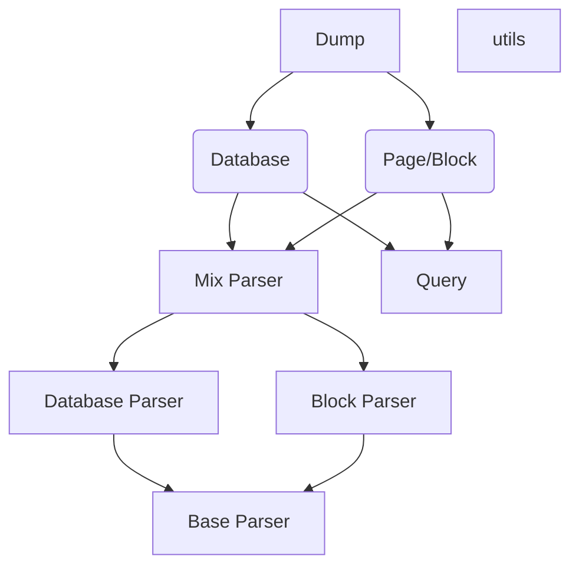

# notion-dump-kernel

[English_Version](https://github.com/delta1037/notion-dump/blob/main/README_En.md)

------

## 一、项目说明

本仓库是基于notion-client（notion官方API）的开发，主要实现目标有

- [x] 将Notion数据库（Table）导出为CSV文件
- [x] 将Notion Page页面或者一个单独的Block导出为md文件
- [x] 递归导出page中的指向page或者数据库（Table）中的子页面
- [x] 递归导出数据库中Title对应的Page页面，及其递归（和上一条结合起来简而言之对于Page和Database Table之间的相互嵌套均可以递归导出）
- [ ] 将Notion Page页面导出到数据库（SQL）
- [ ] 将数据库（SQL）导出成md&CSV文件

## 二、项目结构

```shell
notoin-dump
├─NotionDump
│  ├─Dump   # 对外接口
│  ├─Notion # 与Notion通信统一封装接口
│  ├─Parser # 实现的一些解析器
│  ├─SQL    # 数据库部分，TODO
│  └─utils  # 内部变量与杂项函数
└─Tests 	# 测试代码
```




## 三、使用方法

### 3.0 安装导入

**安装`notion-dump-kernel`**

```powershell
# 打开终端，输入如下命令安装（测试通过版本为0.0.3）
pip install notion-dump-kernel
# 或者
pip install notion-dump-kernel==0.0.3
```

**导入使用**

```python
import NotionDump
from NotionDump.Dump.dump import Dump
from NotionDump.Notion.Notion import NotionQuery
```


### 3.1 对外统一接口

```python
# 获取Notion查询句柄
query_handle = NotionQuery(
    token=TOKEN_TEST,                  # Token
    client_handle=None,                # Notion官方API句柄，默认为空
    async_api=False                    # 异步调用，默认为False
)

# 获取操作句柄
handle = Dump(
    dump_id=ID,                        # 需要导出的页面ID
    query_handle=query,                # Notion查询句柄
    export_child_pages=True, 		   # 是否递归导出子页面
    dump_type=NotionDump.DUMP_TYPE_XXX # ID的类型，详细见后续说明
)

# dump类型 dump_type
DUMP_TYPE_BLOCK						   # 块类型
DUMP_TYPE_PAGE						   # 页面类型
DUMP_TYPE_DB_TABLE                     # 数据库Table类型

# 其它
# 变量自解释，不再赘述
```


### 3.2 获取输出

dump的结果存放在一个字典变量中，改变量包含了外部可以操作的所有新信息，获取输出和输出解释如下

```python
# 获取输出
dump_output = dump_handle.dump_to_file()
# 其中dump_handle为上述的操作句柄（Dump(xxx)返回值）
```

```json
// 输出解释
// 输出是一个字典，key值是id
{
    "id_1": {
        "dumped": true,			          // id指向的资源是否成功下载
        "main_page": true,		          // 页面是否是主页
        "page_recursion": true,           // 内部使用变量，传出去的字典中改值均为true
        "type": "page",                   // id的类型，database或者page
        "local_path": "xxxx.md/xxxx.csv", // 导出的文件位置，供后续操作
        "page_name": "",                  // 页面是否有名称（后续重定位使用）
        "child_pages": [
            "child_id",                   // 包含的子页面或者子数据库
            "child_id"
        ]
    },
    "id_2": {
        "dumped": true,			          
        "main_page": true,		          
        "page_recursion": true,           
        "type": "page",                   
        "local_path": "xxxx.md/xxxx.csv", 
        "page_name": "",                  
        "child_pages": []
    }
}
```


## 四、待完成

### 4.1 导出到SQL数据库

基本方案：数据库导出是将所有的page存储到一张表里，将导出的每一个CSV文件作为一张表存储

我数据库不太行，只能想到这样的存储方法


## 五、注意

**已知的问题**

- [ ] 评论内容无法获取到
- [ ] 数据库CSV只是存了下来，但是本地查看因为没有格式极其不方便


## 附录

### 项目测试

[项目测试页面](https://delta1037.notion.site/Notion-dump-ed0a3b0f57b34712bc6bafcbdb413d50)
