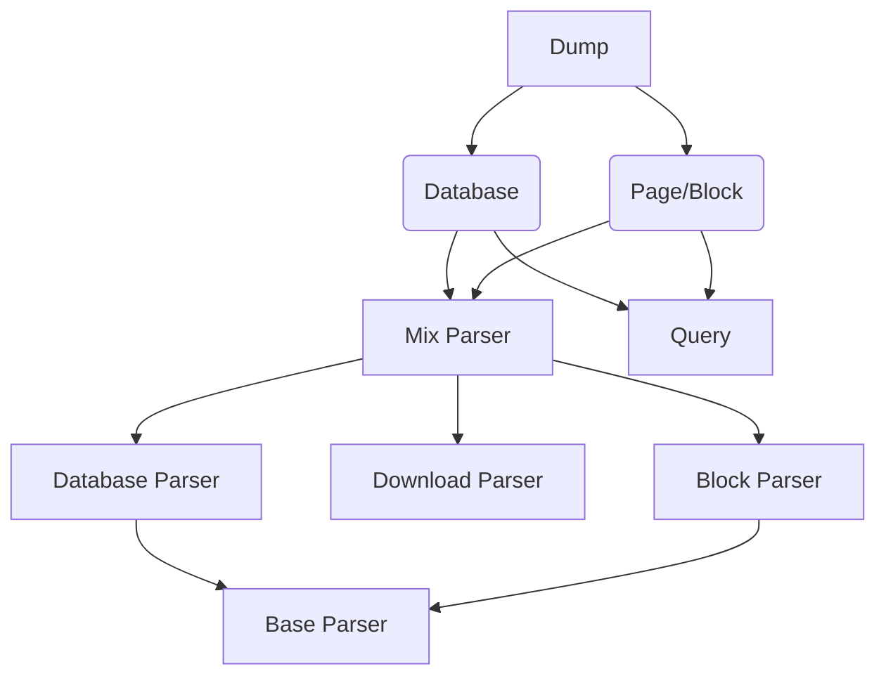

# notion-dump-kernel

## Description

This Repo is a development based on notion-client（notion official API），and the initial target is to provide convenience for [exporting notes and generating pdf](https://github.com/delta1037/KnowledgeShare) files

Main targets

- [x] Export Notion Database(Table) as a csv file
- [x] Export Notion Page or Block as md file
- [x] Recursion Export child Page or Database(Table)  in Page
- [x] Recursion Export child Page in Database(Table) （All in all，all can Recursion Export）
- [x] Export Img and Files
- [ ] Export Notion Page as SQL
- [ ] Export  SQL as md&CSV file

## Structure

```shell
notoin-dump
├─NotionDump
│  ├─Dump   # External Interface
│  ├─Notion # Unified encapsulation interface for communication with Notion
│  ├─Parser # Some parser
│  ├─SQL    # About SQL, TODO
│  └─utils  # Internal variables and utils functions
└─Tests 	# Test code
```




## Usage

### 3.0 install & import

**install `notion-dump-kernel`**

```powershell
# open terminal, type the cmd (install the latest version)
pip install notion-dump-kernel
```

**import**

```python
import NotionDump
from NotionDump.Dump.dump import Dump
from NotionDump.Notion.Notion import NotionQuery
```


### 3.1 API

```python
# Get notion query handle
query_handle = NotionQuery(
    token=TOKEN_TEST,                  # Token
    client_handle=None,                # Notion official API handle, default is None(use token is OK)
    async_api=False                    # async, default is False
)

# Get dump handle 
handle = Dump(
    dump_id=ID,                        # the ID which need to export (block, page or database)
    query_handle=query,                # Notion query handle (NOT the offical API handle)
    export_child_pages=True, 		   # Recursion export child page 
    page_parser_type=NotionDump.PARSER_TYPE_MD,  	# Page export type
    db_parser_type=NotionDump.PARSER_TYPE_PLAIN,	# Database export type
    dump_type=NotionDump.DUMP_TYPE_XXX # ID type, see the descriptions below
)

# dump type ( dump_type )
DUMP_TYPE_BLOCK						   # Block type
DUMP_TYPE_PAGE						   # Page type
DUMP_TYPE_DB_TABLE                     # Database table type

# Export type
PARSER_TYPE_MD										# Markdown
PARSER_TYPE_PLAIN									# plain text

# Other
# the varible itself shows all
```


### 3.2 Get output

The result of dump save at a dictionary variable , which contain all info about dumped files. The explain of output shows below.

```python
# Get output
dump_output = dump_handle.dump_to_file()
# dump_handle is the return value of Dump(xxx)
```

输出样例：

```json
{
    "key_id_1": {
        "dumped": true,
        "main_page": true,
        "type": "page",
        "local_path": "xxxx",
        "page_name": "",
        "link_id": "",
        "child_pages": [
            "xxxxx",
            "xxxxx"
        ],
        "inter_recursion": true,
        "inter_soft_page": false
    },
    "key_id_2": {
        "dumped": false,
        "main_page": false,
        "type": "page",
        "local_path": "",
        "page_name": "",
        "link_id": "xxxxx",
        "child_pages": [],
        "inter_recursion": true,
        "inter_soft_page": false
    }
}
```

**output explain**：

-   id_1：key is id (block id/page id/database id) and it is the combination of link name and id in link page，the id is the tag to relocate link in page
-   dumped：download status of the resource specifid by id
-   main_page：whether the page is the page specifid by input id (root)
-   type：id type, database or page (page type contain page and block)（if id_1 is a link the type is the page type that the link linked）
-   local_path：the location of export file, for subsequent operations
-   page_name：page name (for subsequent relocation of page url)
-   child_pages：subpage or database id this key_id contain
-   inter_recursion：internal variable(NOT use)
-   inter_soft_page：internal variable(NOT use)

## TODO

### 4.1 Export to SQL

Plan: All page save in one table, and every csv file save as a table

*My SQL skills is very weak*

*If you can't understand my README, my English is also terrible (come from Google translate)*

## Attention

**Problem**

- [ ] Comment can't export
- [ ] the csv file lost it's format shows in notion client

## Others

### 6.1、Notion Test Page

[Notion Test Page](https://delta1037.notion.site/Notion-dump-ed0a3b0f57b34712bc6bafcbdb413d50)

### 6.2 Notion dump

which base on notion-dump-kernel, it is used to rebuild the structure of dumped files and relocate the link in pages

[Project link](https://github.com/delta1037/notion-dump)

