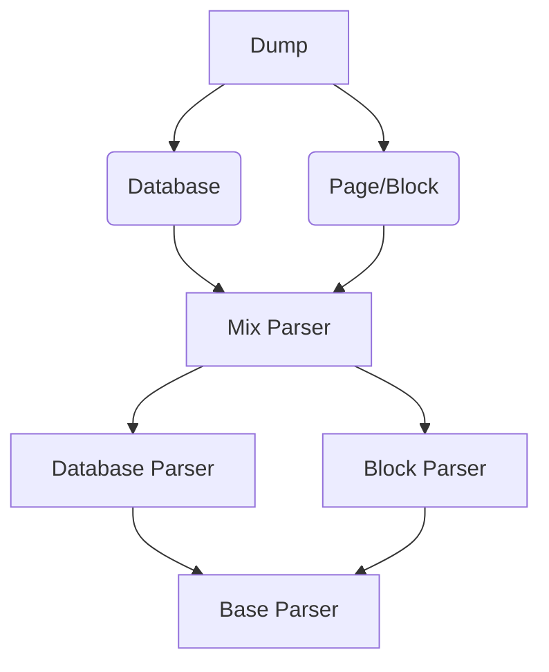

# notion-export-kernel


------

## 一、项目说明

本仓库是基于 [notion-sdk-py](https://github.com/ramnes/notion-sdk-py)（notion官方API）的开发，导出Notion页面和数据库。

项目目标

- [x] 将Notion页面和数据库导出为Markdown文件
- [x] 递归导出所有子页面（或者链接）
- [x] 下载文件和图片

## 二、项目结构

```shell
notoin-dump
├─NotionDump
│  ├─Dump   # 对外接口
│  ├─Notion # 与Notion通信统一封装接口
│  ├─Parser # 实现的一些解析器
│  └─utils  # 内部变量与杂项函数
└─Tests 	# 测试代码
```




## 三、使用方法

### 3.0 安装导入

**安装`notion-dump-kernel`**

```powershell
# 打开终端，输入如下命令安装（装最最新版）
pip install python-dateutil
pip install notion-dump-kernel
```

**导入使用**

```python
import NotionDump
from NotionDump.Dump.dump import Dump
from NotionDump.Notion.Notion import NotionQuery
```


### 3.1 对外统一接口

```python
# 获取Notion查询句柄
query_handle = NotionQuery(
    token=TOKEN_TEST,                  				# Token
    client_handle=None,                				# Notion官方API句柄，默认为空
    async_api=False                    				# 异步调用，默认为False
)

# 获取操作句柄
handle = Dump(
    dump_id=ID,                        				# 需要导出的页面ID
    query_handle=query,                				# Notion查询句柄
    export_child_pages=True, 		   				# 是否递归导出子页面
    page_parser_type=NotionDump.PARSER_TYPE_MD,  	# Page导出类型
    db_parser_type=NotionDump.PARSER_TYPE_PLAIN,	# 数据库导出类型
    dump_type=NotionDump.DUMP_TYPE_XXX 				# ID的类型，详细见后续说明
)

# dump类型 dump_type
DUMP_TYPE_BLOCK						   				# 块类型
DUMP_TYPE_PAGE						   				# 页面类型
DUMP_TYPE_DB_TABLE                     				# 数据库Table类型

# 导出类型
PARSER_TYPE_MD										# Markdown格式
PARSER_TYPE_PLAIN									# 纯文本格式

# 其它
# 变量自解释，不再赘述
```

[操作示例](https://github.com/delta1037/notion-dump-kernel/tree/main/Examples)

### 3.2 获取输出

dump的结果存放在一个字典变量中，改变量包含了外部可以操作的所有新信息，获取输出和输出解释如下

```python
# 获取输出
dump_output = dump_handle.dump_to_file()
# 其中dump_handle为上述的操作句柄（Dump(xxx)返回值）
```

输出样例：

```json
{
    "key_id_1": {
        "dumped": true,
        "main_page": true,
        "type": "page",
        "local_path": "xxxx",
        "page_name": "",
        "link_id": "",
        "child_pages": [
            "xxxxx",
            "xxxxx"
        ],
        "inter_recursion": true,
        "inter_soft_page": false
    },
    "key_id_2": {
        "dumped": false,
        "main_page": false,
        "type": "page",
        "local_path": "",
        "page_name": "",
        "link_id": "xxxxx",
        "child_pages": [],
        "inter_recursion": true,
        "inter_soft_page": false
    }
}
```

**输出解释**：

-   key_id_1：键值，也是dump下来的页面需要重定位的标志
-   dumped：id指向的资源是否成功下载
-   main_page：页面是否是主页
-   type：该id的类型，database或者page（链接的话是链接指向的页面的类型）
-   local_path：导出的文件位置，供后续操作
-   page_name：页面是否有名称（后续重定位使用）
-   child_pages：包含的子页面或者子数据库
-   inter_recursion：内部使用变量，无需关注
-   inter_soft_page：内部使用变量，无需关注

## 五、注意

- [ ] 不支持评论内容

## 六、附录

### 6.1、项目测试

[项目测试页面](https://delta1037.notion.site/Notion-dump-ed0a3b0f57b34712bc6bafcbdb413d50)

### 6.2 Notion dump client

基于notion-dump-kernel做的一个对下载下来的页面重新组合文件结构，并对其中的链接部分进行重定位的项目

[项目Github地址](https://github.com/delta1037/notion-export-local)

